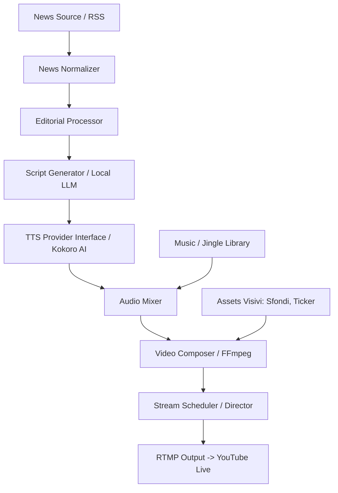

# Architettura di Sistema NewsicaTV

Il sistema è basato su una pipeline modulare rigorosa. Nessun modulo deve dipendere fortemente dalle implementazioni di terze parti (es. l'interfaccia verso Kokoro AI deve essere astratta per poter swappare con Piper TTS).

## Flusso Logico (Modular Pipeline)

### Dettaglio dei Nodi:
1. **News Normalizer**: Prende RSS, JSON, HTML e li trasforma in un formato testuale grezzo unificato.
2. **Editorial Processor**: Scarta i duplicati, filtra notizie spam, categorizza in base al "Palinsesto" stabilito.
3. **Script Generator**: Un LLM Locale (es. Ollama) trasforma le news grezze in testo parlato per radio/TV.
4. **TTS Provider**: Genera i file audio locali (WAV/MP3).
5. **Audio Mixer**: Aggiunge compressione audio, normalizza i volumi, inserisce jingle e sfuma i brani.
6. **Video Composer**: Assembla lo sfondo animato, sovrappone i testi dinamici (Lower thirds, Ticker) generati in base alla news corrente.
7. **Stream Scheduler / RTMP Output**: Il loop infinito che mantiene la connessione con i server YouTube e assicura il riavvio automatico in caso di crash.
