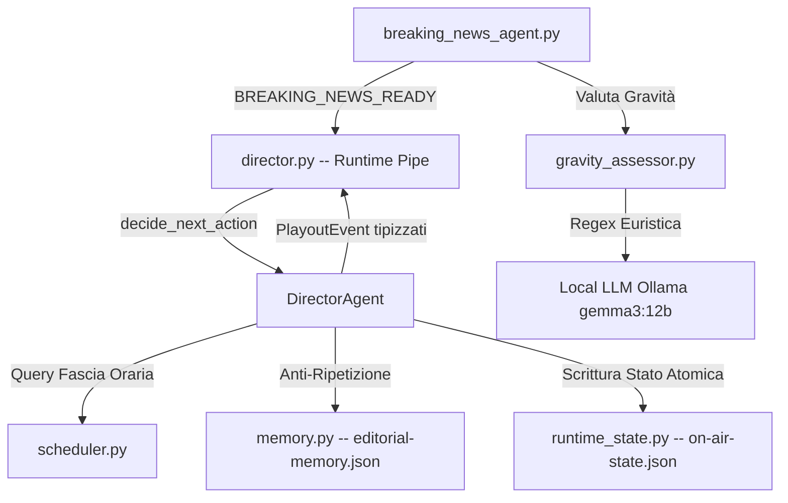
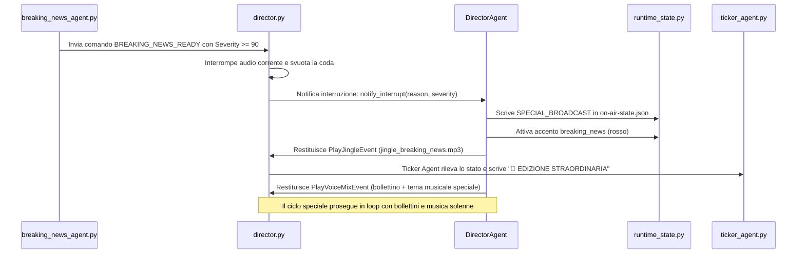

# Guida Tecnica ed Editoriale: DirectorAgent & Trasmissione Straordinaria

Questo documento illustra l'architettura, la logica e i dettagli operativi della nuova regia AI centrale di NewsicaTV (**DirectorAgent**) e della gestione delle edizioni straordinarie (**SPECIAL_BROADCAST**).

---

## 1. Filosofia di Regia: Palinsesto Sovrano
La logica di NewsicaTV segue un principio fondamentale:
> **Il palinsesto decide cosa va in onda, il DirectorAgent decide come.**

Il sistema rispetta rigorosamente i contratti temporali con lo spettatore (es. alle 14:00 va in onda *Pausa Wellness*, alle 15:00 *News Update*). Tuttavia, all'interno dello slot assegnato, il `DirectorAgent` agisce da regista intelligente:
* Alterna i segmenti parlati del copione a canzoni della playlist.
* Seleziona i brani in modo dinamico per evitare ripetizioni ravvicinate.
* Evita di riproporre le stesse notizie o le stesse frasi introduttive dello speaker.
* Adatta il tono in base alla rubrica o alla situazione editoriale.

---

## 2. Architettura dei Componenti

Il sistema è suddiviso in moduli specializzati posizionati nei pacchetti `newsica.broadcast` e `newsica.editorial`, garantendo una separazione netta tra il controllo a basso livello (FFmpeg/Pipe) e le decisioni a livello editoriale.



### A. Il Motore delle Fasi (`scheduler.py`)
Calcola in tempo reale la fascia oraria corrente sul wall-clock di sistema, determinando le scadenze (*deadline*) precise per il passaggio automatico allo slot successivo del palinsesto.

### B. Memoria Editoriale (`memory.py`)
Gestisce un database JSON locale (`editorial-memory.json`) che tiene traccia di:
* Canzoni riprodotte di recente (per evitare la ripetizione ravvicinata).
* Rubriche e copioni trasmessi.
* Data e ora dell'ultimo annuncio standard, consentendo al sistema di variare l'introduzione dello speaker se rientra in onda dopo un brano musicale (es. *"Torniamo su Pausa Wellness..."* invece dell'introduzione classica).

### C. Gestione dello Stato Runtime (`runtime_state.py`)
Scrive lo stato della messa in onda in `on-air-state.json` tramite **scrittura atomica** (salvataggio su file `.tmp` e sostituzione con `os.replace`). Questo previene file corrotti o parziali a causa di accessi concorrenti da parte di:
* **Ticker Agent**: legge lo stato per generare il testo scorrevole in basso.
* **Dashboard**: mostra la traccia e la rubrica attiva in tempo reale.
* **FFmpeg**: legge i testi statici per generare l'overlay a schermo.

Gestisce inoltre l'attivazione degli **accenti grafici** (`accent_news.txt`, `accent_breaking.txt`, ecc.), abilitando l'overlay del colore corretto a seconda del blocco attivo.

### D. Protocollo unico a eventi (`playout_events.py`)
Il refactor del Director e' stato completato eliminando il vecchio bridge ibrido tra `dict` legacy (`{"action": "PLAY_*"}`) e oggetti evento. Oggi:
* `DirectorAgent` restituisce solo `PlayoutEvent`;
* `director.py` esegue solo `PlayoutEvent`;
* side effect come il trigger della nuova musica AI risiedono negli eventi stessi e non in branch speciali del loop.

Questo ha rimosso una classe di bug in cui lo stato avanzava correttamente ma l'audio, i jingle o la schedulazione dei job collaterali non partivano.

### E. Supervisione idempotente degli agenti secondari
Il `director` avvia agenti collaterali tramite `SubprocessSupervisor`, ma il supervisor ora e' idempotente:
* prima di lanciare un agente controlla se esiste gia' un processo vivo per quello script;
* se il processo esiste, logga uno `skip` e non tenta un secondo avvio;
* `hourly_chime_agent.py` e `preparation_agent.py` sono stati irrigiditi con un lock singleton locale, come gia' avveniva per ticker, overlay e chat.

Questo evita che un restart del solo director produca:
* errori rumorosi di singleton nei log;
* doppie istanze reali di agent privi di lock;
* effetti collaterali come doppia preparazione degli slot o doppio scheduling del segnale orario.

### F. Recovery di restart senza replay del parlato
Quando il solo `director.py` viene riavviato, non e' possibile riprendere un file PCM esattamente a meta' battuta. La strategia runtime attuale e' quindi intenzionalmente pragmatica:
* se lo stato corrente appartiene ancora allo slot wallclock attivo, il director prova a preservare il contesto editoriale;
* se il segmento era gia' musicale, lo mantiene cosi';
* se il segmento era parlato (`podcast_playing`, `voice_part_*`, `voice_closing`, ecc.), il director degrada il blocco a `music_rotation_until_deadline`;
* per i podcast viene anche marcato `podcast_played = true`, cosi' la puntata non riparte dall'inizio.

Obiettivo: evitare il replay artificiale della parte 1 o del podcast completo dopo un restart tecnico, pur mantenendo la continuita' della fascia in onda.

---

## 3. Valutazione Gravità Notizie (`GravityAssessor`)

Per innescare o meno un'Edizione Straordinaria, ogni breaking news viene valutata da un sistema a due livelli di gravità (punteggio da 0 a 100):

1. **Livello 1: Euristica Locale (Regex)**:
   Analizza il testo della notizia confrontandolo con parole chiave ad alta gravità (*terremoto, attentato, guerra, alluvione, decessi, ucciso, arresto eccellente*). Se l'euristica calcola un punteggio inferiore a 50, la notizia è considerata cronaca ordinaria e non attiva procedure d'urgenza.
2. **Livello 2: Validazione Locale con LLM (Ollama)**:
   Se l'euristica calcola un punteggio $\ge 50$, viene interrogata l'istanza locale di Ollama (`gemma3:12b` o `qwen2.5`) con un prompt specifico. L'LLM restituisce un JSON strutturato indicando se si tratta di una **vera emergenza nazionale/internazionale**, rettificando il punteggio ed eliminando i falsi positivi (es. scioperi o notizie di archivio).

---

## 4. Flusso della Trasmissione Straordinaria (SPECIAL_BROADCAST)

Quando una notizia ottiene un punteggio di gravità $\ge 90$:



### Caratteristiche del flusso:
* **Tono Sobrio**: Lo speaker sintetizzato con Kokoro AI utilizza un tono giornalistico, chiaro ed autorevole, informando gli spettatori che il palinsesto è stato interrotto per seguire gli eventi in tempo reale.
* **Allineamento Multicanale**: Audio (bollettino), Ticker scorrevole (*🚨 EDIZIONE STRAORDINARIA*) e Overlay grafici (colore rosso fisso in basso) si attivano all'unisono.

---

## 5. Rientro in Palinsesto: Soglia Minima Dinamica

Le edizioni straordinarie rimangono attive fino alla loro revoca manuale o automatica. Al rientro, `DirectorAgent` decide come gestire lo slot orario interrotto calcolando la **durata residua**:

$$\text{Durata Residua \%} = \frac{\text{Ora Fine Slot} - \text{Ora Corrente}}{\text{Durata Totale Slot}} \times 100$$

La soglia runtime attuale non e' piu' un 40% fisso storico. Il rientro usa:

$$\text{soglia} = \max(300s,\; 20\% \text{ della durata slot})$$

* **Caso 1: residuo sopra soglia**:
  Se lo slot interrotto ha ancora tempo sufficiente, il regista ripristina il blocco in `music_rotation_until_deadline` e lascia che la rubrica rientri in modo naturale.
* **Caso 2: residuo sotto soglia**:
  Se il residuo e' troppo basso, il sistema evita un ripristino artificiale della parte 1 e attende il cambio fascia naturale, mantenendo comunque stato coerente fino alla scadenza.

---

## 6. Comandi Operativi per il Test Manuale

### A. Innescare un'Edizione Straordinaria di Test
Per forzare la generazione di un'edizione straordinaria scavalcando la scansione reale delle notizie, imposta la variabile d'ambiente `FORCE_SEVERITY` ad un valore $\ge 90$ all'avvio dell'agente:
```bash
FORCE_SEVERITY=95 ./venv/bin/python src/breaking_news_agent.py
```
L'agente genererà l'audio in `tmp/breaking_news.wav`, valuterà lo score a 95 e invierà il comando `BREAKING_NEWS_READY|...|95|Test forzato` alla regia.

### B. Revocare l'Edizione Straordinaria
Per terminare la trasmissione straordinaria e rientrare nel normale palinsesto ordinario (attivando il calcolo della regola del 40%), invia il comando di revoca:
```bash
echo "REVOKE_SPECIAL_BROADCAST" > runtime/control.txt
```
La regia rileverà il comando, calcolerà la durata residua dello slot originario con la soglia dinamica e ripristinerà o salterà la programmazione in modo del tutto autonomo.
