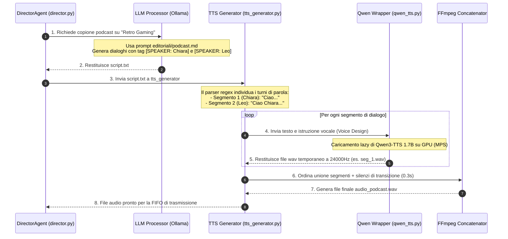

# 🎙️ Brainstorming & Roadmap: Integrazione Qwen3-TTS e Podcast Multi-Speaker in Italiano

> Aggiornamento 2026-05-20: questa direzione e' stata superata da ADR 0021. Qwen3-TTS locale non viene usato come motore podcast definitivo; la pipeline podcast usa Chatterbox Multilingual con reference audio reali per Giulia/Marco e fallback Kokoro. Fish Audio S2 e' stato valutato ma scartato su questa macchina per prestazioni MPS insufficienti.

Questo documento analizza in dettaglio l'integrazione di **Qwen3-TTS** in NewsicaTV per l'abilitazione di rubriche in formato **Podcast Talk Show Multi-Speaker**. Qui facciamo brainstorming sulla scelta della libreria, definiamo l'architettura tecnica e tracciamo una roadmap evolutiva.

---

## 🔍 Analisi Comparativa: GitHub `qwen3-TTS-studio` vs `qwen3-TTS` Ufficiale

L'utente ha sollevato un ottimo punto interrogativo: *Dobbiamo usare la repo `qwen3-TTS-studio` o basta semplicemente la libreria `qwen3-TTS` ufficiale?*

### Tabella Comparativa

| Criterio | 🖥️ `qwen3-TTS-studio` (Gradio WebUI) | 📦 `qwen3-TTS` (Libreria Python Ufficiale) |
| :--- | :--- | :--- |
| **Scopo principale** | Interfaccia utente interattiva (Gradio) per test visuali, manuali e creazioni una-tantum. | Libreria di basso livello per l'integrazione programmatica in applicazioni Python. |
| **Adattabilità H24** | **Bassa**. Richiede l'avvio di un server web Gradio locale ed è pensata per l'input manuale da form. | **Massima**. Può essere importata come modulo Python standard in script headless in background. |
| **Controllo Multi-Speaker** | Offre un parser basato su righe di testo per alternare le voci in una demo web. | Espone le primitive (`generate_voice_design`, `generate_clone`) per creare blocchi audio arbitrari. |
| **Gestione della memoria** | Carica il modello in un server Gradio che rimane persistente in RAM, occupando risorse preziose. | Consente la logica **Lazy Loading** (il modello viene caricato in RAM/GPU solo quando serve la rubrica podcast). |
| **Dipendenze esterne** | Aggiunge Gradio, WebUI server, e pacchetti frontend non necessari a NewsicaTV. | Dipendenze ridotte all'essenziale (`torch`, `transformers`, `qwen-tts`). |

### 💡 Verdetto del Brainstorming

> [!TIP]
> **Consigliamo l'integrazione della libreria ufficiale `qwen3-TTS`** nel nostro modulo wrapper `src/newsica/audio/qwen_tts.py`.
> 
> **Perché?**
> NewsicaTV è una regia automatica H24 ad alta stabilità. Non possiamo dipendere da una WebUI esterna o da un processo Gradio separato che l'utente dovrebbe avviare a mano.
> Tuttavia, **mutuiamo le eccellenti idee di `qwen3-TTS-studio`**:
> 1. Creare **Preset Vocali** basati sul **Voice Design** (descrizioni testuali stabili della voce).
> 2. Implementare un **Parser Regex di Tag** (es. `[SPEAKER: Chiara]`) per spezzare il testo del podcast.
> 3. Gestire la concatenazione dei singoli file audio intermedi in modo deterministico via codice Python.

---

## 🎨 Il Concept: I Nuovi Conduttori Virtuali (Chiara & Leo)

Per dare al canale NewsicaTV un'impronta editoriale da vera emittente radiotelevisiva, introduciamo due conduttori podcast virtuali ricorrenti con stili vocali differenziati tramite **Voice Design** (istruzioni semantiche in italiano).

```
         +-----------------------------------------------------------+
         |                     NEWSICA TALK                          |
         |         Un podcast quotidiano a due voci                  |
         +-----------------------------+-----------------------------+
                                       |
                   +-------------------+-------------------+
                   |                                       |
        👩‍💼 [SPEAKER: Chiara]                     👨‍💼 [SPEAKER: Leo]
   Voce: Chiara (Voice Design)             Voce: Leo (Voice Design)
   Tono: Seria, istituzionale, chiara      Tono: Dinamico, entusiasta, caldo
   Ruolo: Giornalista, conduttrice         Ruolo: Commentatore, esperto tech
```

### Le Istruzioni Vocali (Voice Design Prompts)

Per evitare di dipendere da file audio di clonazione esterni (che potrebbero degradarsi o non essere licenziabili), configuriamo due voci stabili descritte a parole in Qwen3-TTS:

*   **Chiara (Istruzione):**
    > *"A clear, highly professional young Italian female news anchor, speaking with a standard broadcast accent, natural cadence, and serious yet engaging tone."*
*   **Leo (Istruzione):**
    > *"A warm, charismatic, and enthusiastic young Italian male radio host, speaking with an energetic, modern tone and natural conversational pacing."*

---

## 🗓️ Le Nuove Rubriche Podcast per il `DirectorAgent`

Il `DirectorAgent` (tramite `schedule_generator.py`) potrà inserire a palinsesto diverse rubriche speciali a seconda dell'orario della giornata. Ollama genererà lo script su misura per la rubrica selezionata:

1.  **Newsica Talk — Tech Pulse (Fascia Pomeridiana):**
    *   *Tematica:* Ultime novità su Intelligenza Artificiale, gadget e spazio.
    *   *Stile:* Dialogo informale e brillante tra Chiara e Leo.
2.  **L'Angolo del Benessere (Fascia Mattutina):**
    *   *Tematica:* Salute, alimentazione, fitness e cura della persona.
    *   *Stile:* Chiara conduce, Leo fa domande curiose ed entusiastiche.
3.  **Retro Corner (Fascia Serale/Notturna):**
    *   *Tematica:* Storia dei videogiochi, retro-computing, curiosità nostalgiche dagli anni '80/'90.
    *   *Stile:* Leo conduce da esperto appassionato, Chiara commenta con aneddoti storici.

---

## 🛠️ Flusso Architetturale del Generatore di Podcast



---

## 📈 Roadmap di Implementazione: Da Test Locali a Messa in Onda

Proponiamo un percorso incrementale in **4 Fasi** per testare la stabilità locale e integrare la feature in sicurezza senza interrompere il canale live H24.

### 📍 Fase 1: Verifica di fattibilità e prestazioni locali (IN CORSO)
*   [x] Setup dell'ambiente virtuale (`torch` + `qwen-tts`).
*   [x] Scrittura di `src/newsica/audio/qwen_tts.py` per l'inferenza locale (MPS/CPU).
*   [ ] Esecuzione e profilazione di `tmp/scratch/test_qwen.py`.
    *   *Obiettivo prestazionale:* Generare 10 secondi di audio in meno di 8 secondi (RTF < 0.8) su Apple Silicon GPU (MPS) per garantire che la pre-generazione dei podcast non ritardi la scaletta.

### 📍 Fase 2: Implementazione del Parser e dei Turni di Parola
*   [ ] Creazione del prompt di sistema in italiano per dialoghi in `src/newsica/editorial/prompts/podcast.md`.
*   [ ] Configurazione del personaggio `"podcast"` (Chiara & Leo) in `src/newsica/domain/characters.json`.
*   [ ] Modifica di `src/tts_generator.py` per:
    *   Rilevare i blocchi `[SPEAKER: Chiara]` e `[SPEAKER: Leo]` con espressione regolare.
    *   Generare i file WAV temporanei per ogni pezzo.
    *   Miscelarli aggiungendo pause fisiologiche (silenzio di 0.3s a 24000Hz) per dare naturalezza alla conversazione.

### 📍 Fase 3: Collegamento al `DirectorAgent` e al Palinsesto
*   [ ] Aggiornamento di `src/schedule_generator.py` per inserire blocchi di tipo `"podcast"` (es. una rubrica da 5-7 minuti ogni 2 ore).
*   [ ] Predisposizione in `director.py` dell'aggancio per caricare e trasmettere il file audio unificato `audio_podcast.wav` con un overlay dedicato sullo schermo (es. "NEWSICA TALK - Chiara & Leo in studio").

### 📍 Fase 4: Validazione ed Estensioni Creative
*   [ ] Monitoraggio dell'uso della memoria e del calore del Mac durante le fasi di picco del TTS.
*   [ ] Sperimentazione con clonazione vocale reale (Voice Cloning) fornendo un audio campione in `assets/voices/` per rendere le voci ancora più caratteristiche.
*   [ ] Inserimento di sottofondi musicali lo-fi sidechained (sotto i dialoghi) tramite FFmpeg per simulare un vero studio radiofonico.

---

## 🎯 Prossimi Passi Consigliati
1.  **Attendere la fine dello script di test** `test_qwen.py` per confermare le metriche di esecuzione locale su Mac.
2.  **Apportare le modifiche a `tts_generator.py`** per implementare la logica del parser dei dialoghi.
3.  **Configurare `characters.json`** con i preset di Chiara e Leo.
